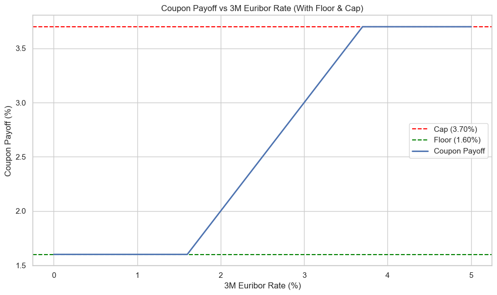
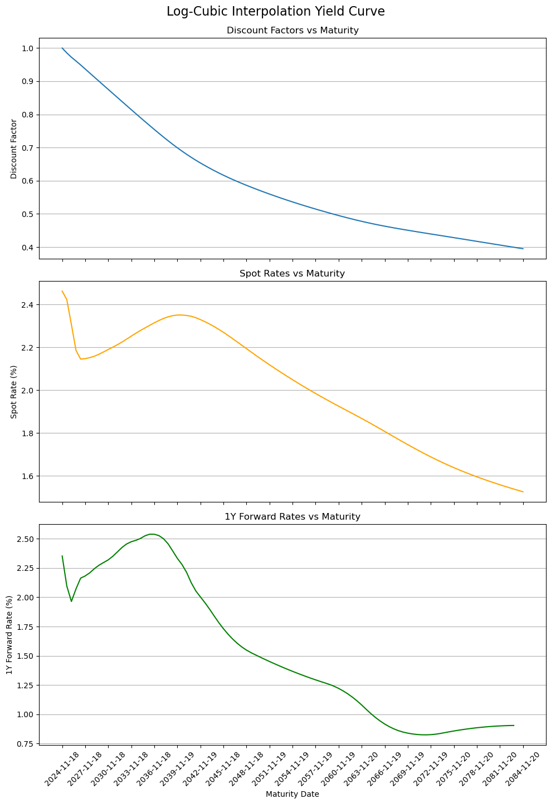
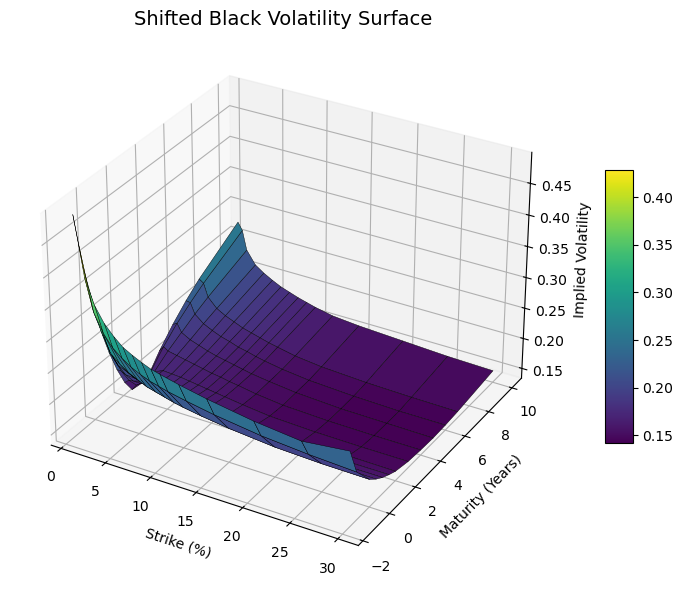

# Fixed Income Project

This project was developed as part of the MSc Mathematical Trading and Finance programme at Bayes Business School (formerly Cass). It focuses on the valuation and hedging of a structured bond issued by BNP Paribas, using market data from early 2024. The project combines curve construction, derivative pricing, credit risk modelling, and sensitivity analysis, implemented in Python via the QuantLib library.

## Problem

Structured interest rate products present a number of technical challenges: from curve construction and model calibration, to pricing multi-leg payoffs and designing effective hedges. Compared to equity instruments, where mispricings can often be evaluated using relatively direct methods, fixed income instruments demand an entire modeling infrastructure before valuation can even begin. The goal of this project was to decompose, price, and hedge a 5-year capped, floored Floating Rate Note (FRN), and quantify its exposure to credit and interest rate risk.

## My Reflections

This was the most intellectually demanding project I undertook during my MSc. What struck me most was the sheer volume of work required before you can even arrive at a clean price: selecting the right curve, calibrating a model, dealing with accrued interest, adjusting for credit risk via CVA, computing DV01, and constructing a hedging strategy with swaps and CDS. Equity pricing suddenly felt straightforward in comparison. I also took the initiative to move our team from Excel to QuantLib, which offered far greater flexibility in curve construction and pricing logic. I taught myself the library in a week while building the deliverables; a steep but rewarding learning 'curve'.

## Methods

- Curve Construction: Interpolated a log-cubic discount curve from deposit and swap instruments
- Bond Pricing: Forecasted floating coupons based on 3M Euribor projections and priced using present value logic
- Option Strip Pricing: Modelled the cap, floor component as a strip of interest rate options using the Black model
- Credit Risk Adjustment: Applied a simplified Credit Valuation Adjustment (CVA) using bootstrapped survival probabilities from CDS spreads
- Hedging Strategy: Constructed a hedge using interest rate swaps and credit default swaps to neutralise DV01 and credit exposure
- Risk Metrics: Conducted Monte Carlo simulations to compute 99% Value-at-Risk and Expected Shortfall across key risk factors

## Repository Structure

```
Fixed-Income-Project/
├── code/
├── datasets/
├── figures/
├── images/
├── results/
├── task/
├── .gitignore
├── README.md
├── Report.pdf
├── Task.pdf
├── requirements.txt
```

## Key Figures

### Coupon Payoff Structure


### Interpolated Log-Cubic Curve


### Implied Volatility Surface


## Requirements

```bash
pip install -r requirements.txt
```

Note: This project uses the QuantLib Python package. Installation instructions are available at the [QuantLib website](https://www.quantlib.org/install.shtml).

Ensure all market data files (`MarketData.xlsx`, `shifted_black_vols.csv`, etc.) are in the `datasets/` folder before running the scripts.

## How to Run

Open any script from the `code/` directory (e.g., `Q1.py`) and run via your preferred Python IDE or terminal.

## Further Reading

- Veronesi, P.: Fixed Income Securities
- Brigo, D., Mercurio, F.: Interest Rate Models, Theory and Practice

## Authors

- Shaan Ali Remani
- Basil Ibrahim
- Wincy So
- José Santos

---

### Connect

- [LinkedIn](https://www.linkedin.com/in/shaan-ali-remani)
- [GitHub](https://github.com/RemaniSA)
